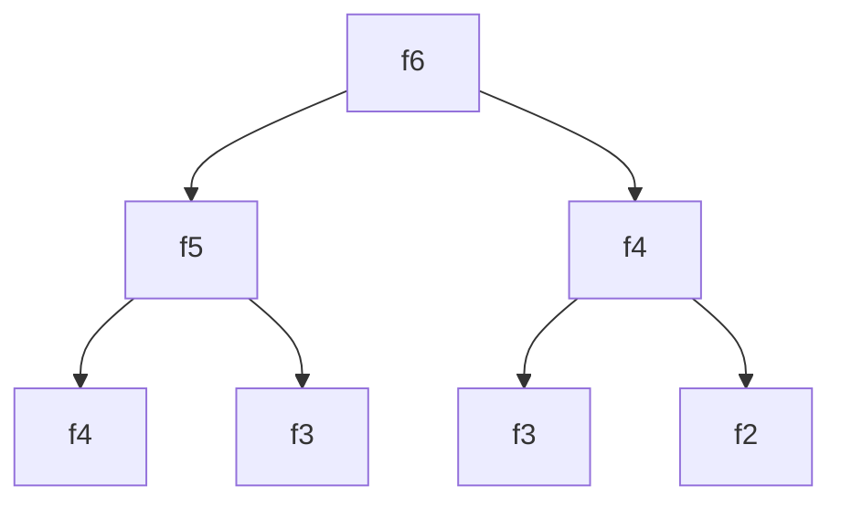

## 时间复杂度和空间复杂的分析

## Big O notation

* O(1)：Constant Complexity 常数复杂度
* O(log n)：Logarithmic Complexity 对数复杂度
* O(n)：Linear Complexity 线性复杂度
* O(n<sub>2</sub>)：N square Complexity 平方复杂度
* O(n<sub>3</sub>)：N cubic Complexity 立方复杂度
* O(2<sub>n</sub>)：Exponential Growth Complexity 指数复杂度
* O(n!)：Factorial Complexity 阶乘复杂度

## 举例

O(1)：函数执行一次或者多次

``` java
int n = 1000;
System.out.println("Hey-your input is:" + n);
```

O(N)：一个循环体

``` java
for(int i = 1; i <= n; i++){
    System.out.println("Hey-I'm busy looking at:" + i);
}
```

O(N<sub>2</sub>)：嵌套循环体

``` java
for(int i = 1; i <= n; i++){
    for(int j = 1; j <= n; j++){
    	System.out.println("Hey-I'm busy looking at:" + i + "and" + j);
	}
}
```

O(log n)

``` java
for(int i = 1; i <= n; i = i * 2){
    System.out.println("Hey-I'm busy looking at:" + i);
}
```

O(k<sup>n</sup>)：Fibonacci数列

``` {java
int fib(int n){
    if(n < 2) return n;
    return fib(n - 1) + fib(n - 2);
}
```

## 时间复杂度曲线


## 求和，计算sum(n)

方法一：循环累加，复杂度O(n)

``` java
int sum(int n){
    int sum = 0;
    for(int i = 1; i <= n; i++)
        sum += i;
    return sum;
}
```

方法二：求和复杂度，复杂度O(1)

``` java
int sum(int n){
    return (1 + n) / 2;
}
```

## 递归时间复杂度分析

使用递归树

实例：求Fibonacci数列的第n项

F(n) = F(n-1) + F(n -2)



面试直接使用递归的形式不好，可以使用记忆函数对递归进行优化

## Master Theorem 主定理

计算递归函数的时间复杂度

一些基本复杂度

* 二分查找：O(log n)
* 二叉树遍历：O(n)
* 二维有序矩阵查找：O(n)
* 一维有序数组查找：O(log n)
* 归并排序：O(nlogn)，也是最优的时间复杂度

## 思考

二叉树遍历-前中后序的时间复杂度分别是多少？

> 二叉树的遍历无论前中后序的时间复杂度都是O(n)，这里的n指的是每个节点，因为二叉树遍历时，每个节点都会访问，且每个节点仅访问一次。

图的遍历：时间复杂度是多少?

> 图的每个节点访问一次，且仅访问一次，所以时间复杂度是O(n)。

搜索算法：DFS(深度优先)、BFS(广度优先)的时间复杂度是多少？

> ​	时间复杂度都是O(n)，每个节点访问一次，且仅访问一次。

二分查找：时间复杂度是多少?

> 时间复杂度是O(log n)。

## 空间复杂度

1. 数组的长度就是空间复杂度
2. 递归的深度就是空间复杂度

## 数组、链表、跳表的基本实现和特性

## 跳表的特点

注意：只能用于元素有序的情况。

所以，跳表(skip list)对标的是平衡时(AVL Tree)和二分查找，是一种 插入/删除/搜索都是O(log n) 的数据结构。

它对打的优势是原理简单、容易实现、方便扩展、效率更高。因此在一些热门的项目李用来替代平衡树，如Redis、LevelDB等。

## 算法思想

1. 对一维有序数组提高查找效率，常用生维的方式，也就是一维变二维
2. 空间换时间

## 数组、链表、跳表的基本实现和特性

## 跳表的特点

注意：只能用于元素有序的情况。

所以，跳表(skip list)对标的是平衡时(AVL Tree)和二分查找，是一种 插入/删除/搜索都是O(log n) 的数据结构。

它对打的优势是原理简单、容易实现、方便扩展、效率更高。因此在一些热门的项目李用来替代平衡树，如Redis、LevelDB等。

## 尾递归优化

> 尾递归：在函数返回的时候，调用自身本身，并且return语句不能包含表达式。编译器或者解释器就可以把尾递归做优化，使递归本身无论调用多少次，都只占用一个栈帧，不会出现栈溢出的情况。

## 长为n的非空字符串的子串个数

>sub_string = n(n + 1) / 2

## 精通一个领域

* Chunk it up 拆分知识点

  * 庖丁解牛
  * 脉络相联

* Deliberate Practicing 刻意练习

* Feedback 反馈

  * 即时反馈
  * 主动型反馈(自己去找)
    * 高手代码(GitHub, LeetCode, tec.)

  * 被动式反馈(高手给你指定)
    * code review

## 切题四件套

1. Clarification  通过反复沟通，确保自己对题目的理解是正确的；
2. Possible solutions 想所有可能的解法，比较不同方法的时间空间复杂度；
3. Coding 多写代码；
4. Test cases 多列举一些测试样例。

## 五遍刷题法(五毒神掌)

刷题第一遍

* 5分钟：读题 + 思考
* 直接看解法：注意！多解法，比较解法优劣
* ***背诵、默写好的解法***

刷题第二遍

* 马上自己写 —> LeetCode提交
* 多种解法比较、体会 —> 优化！

刷题第三遍

* 过了一天后，再重复做题
* 不同解法的熟练程度 —> 专项练习

刷题第四遍

* 过了一周：反复回来联系相同题目

刷题第五遍

* 面试前一周恢复性训练

##  双指针遍历数据且指针不重复的方法

```java
for (int i = 0; i < a.length; ++i) {
    for (int j = i + 1; j < a.length; ++j) {
        
    }
}
```

##  栈和队列的基本实现和特性

* Stack：先入后出；插入、删除皆为O(1)，查询为O(n)
* Queue：先入先出；插入、删除皆为O(1)，查询为O(n)
* Deque：Double-End Queue，头尾都可进行pop和push操作，插入、删除皆为O(1)
* Priority Queue：插入操作O(1)，取出操作O(logN)-按照元素的优先级取出，底层具体实现的数据结构较为多样和复杂：heap(也是多种实现的，不止时二叉树实现的堆，还有Fibonacci堆等)、BST(binary search tree)、treap

## 如果一件事具有最近相关性，可以用Stack解决


